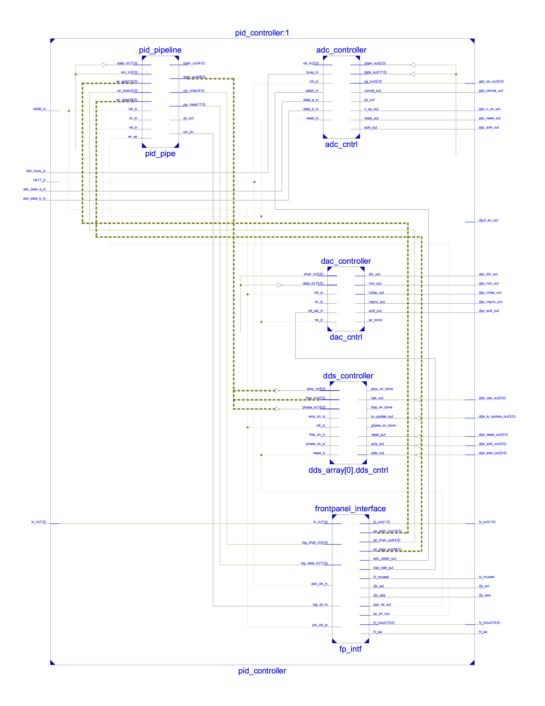
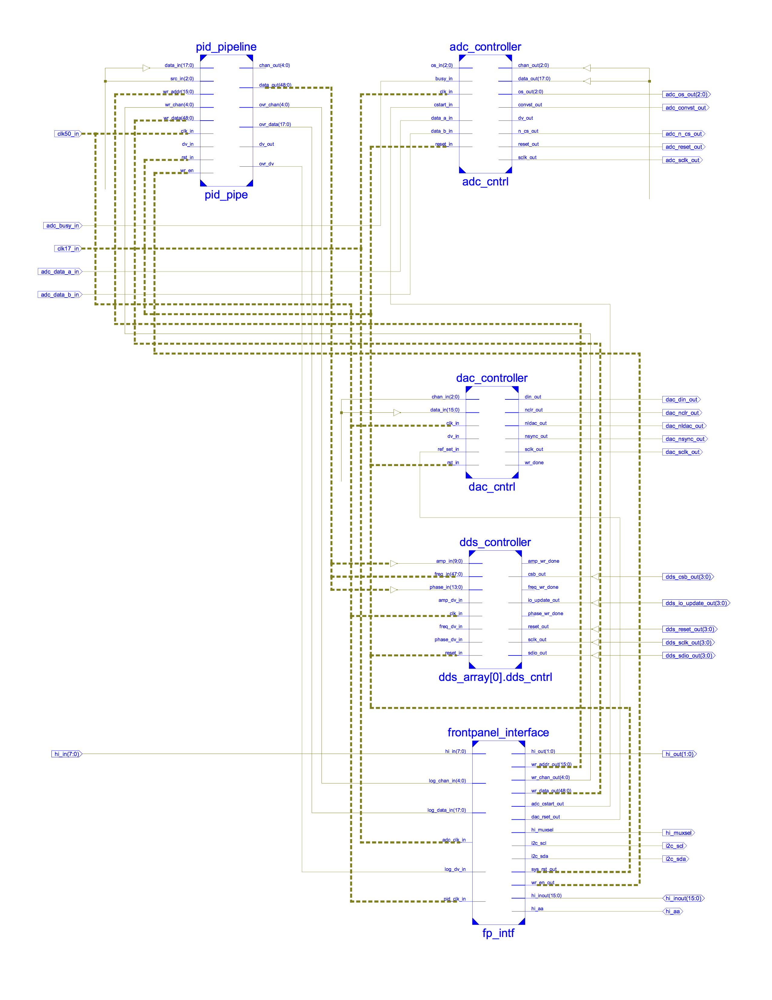
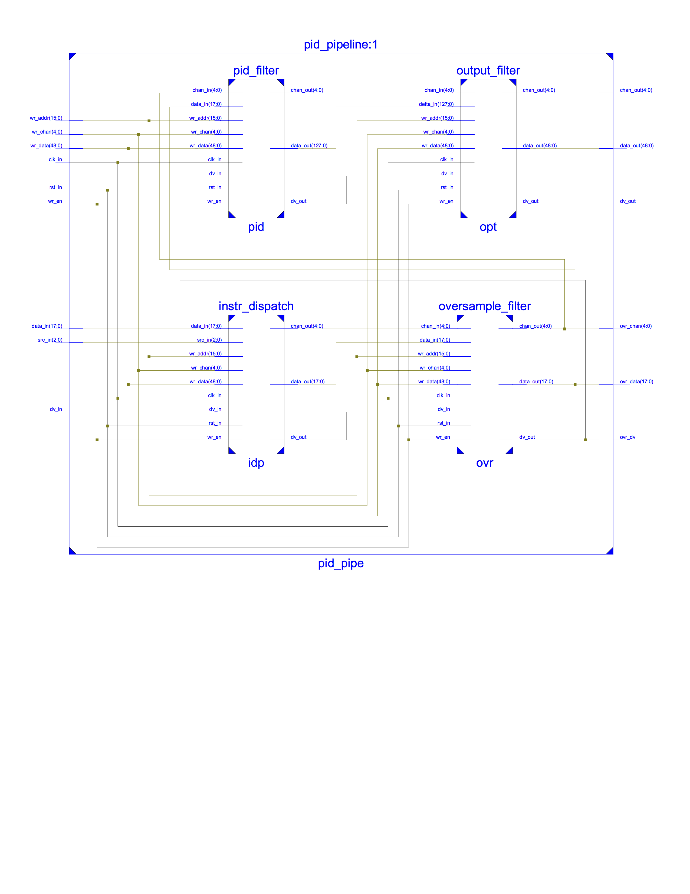

PID Controller
================

## Overview
This document describes a multichannel digital PID controller written in
Verilog and designed for use with the Opal Kelly XEM6010 FPGA
integration module and Duke MIST breakout board. Input data is supplied
to the controller by an eight-channel ADC (Analog Devices AD7608)
integrated on the MIST breakout board.  The controller can be configured
to drive integrated DAC (Texas Instruments DAC8568) or external DDS
(Analog Devices AD9912) outputs. Arbitrary input/output mappings are
supported. Multiple outputs may be driven by the same input. The
controller has a maximum update rate of 100kHz. Optional moving average
filtering is supported on all channels at the cost of reduced channel
update rate. A Python GUI is provided for real time controller
configuration and monitoring.



## Definition of Terms
__PID channel__ refers to a logical channel in the PID controller. There
is a one-to-one mapping between output channels and logical channels, so
the terms _PID channel_ and _output channel_ are used interchangeably.
Occasionally, _PID_ will be omitted if it can be inferred from context.

__Configuration memory__ refers to FPGA memory in the PID controller
that represents its configuration state and can be written from the GUI.
All fields and options in the GUI represent configuration memory. PID
coefficients and oversampling modes are examples of configuration
memory.

__Internal memory__ refers to FPGA memory in the PID controller that
represents its internal state and cannot be written from the GUI.
Previous PID error values and oversample filter accumulating sums are
examples of internal memory.

__PID Requests__ refer to a special type of PID controller write
operation.  Normal configuration memory write operations write a value
into a specific location in PID controller memory specified by the
address and channel endpoints. This value remains constant until it is
overwritten by a new write operation or the system is powered off.
Requests write a single bit to a request register. The target request
register is specified by the address endpoint, and the offset of the bit
to be written is specified by the channel endpoint. The data endpoints
are not used for requests. Once a request bit has been set, it remains
as such only until the request has been processed. After the request has
been processed the bit is cleared.

__PID instruction__ refers the combination of a PID channel number and
ADC data word. PID instructions are generated by the instruction
dispatch stage of the PID pipeline and passed through all subsequent
pipeline stages. If the PID pipeline is viewed as a processor, this
channel-data pair constitutes the processor instruction. The channel
number specifies the output destination of the instruction, which
specifies the PID configuration to be used in processing the ADC data
word.

## Verilog Design
Input data is read by the ADC controller, buffered, and passed to the
PID pipeline.  The PID pipeline looks up the output destination(s)
assigned to the input source and processes the input data.  The
processed data is sent to the DAC controller or one of multiple DDS
controllers depending on destination target. The controllers send update
instructions to their respective chips containing the processed data.
All writing and reading of controller data and all PC management of
controller operation is handled through the frontpanel interface.



### Controller Inputs
The sole source of input in the PID controller default configuration is
the integrated AD7608 ADC chip on the MIST breakout board. The AD7608
supports eight channels each with 18-bits of precision. Additional
inputs could easily be added, provided that the different input streams
are serialized and synced with the PID clock before entry into the PID
pipeline.

#### ADC Controller
The ADC controller manages the AD7608 chip. The controller runs the
AD7608 in continuous conversion mode, where converted ADC data is read
in parallel while new data is converted. This maximizes ADC throughput.

The details of the ADC controller will not be addressed here. The
operation is straightforward and follows the specifications of the
AD7608 datasheet. Refer to the datasheet for more information.

__Note on ADC oversample ratio:__ The AD7608 on the MIST breakout board
is powered by a 3.3V source. At this power level, the maximum allowable
serial clock rate is 17MHz (58.8ns period). Converted data is read from
the AD7608 across two serial data lines. Each conversion cycle, eight
18-bit words must be read to cover all eight channels. The total read
time is `18*(8/2)*58.8ns = 4.23us`. The default AD7608 conversion time
with no oversampling is 4us. It is not possible to read all eight
channels during this time. Thus, the base ADC oversample ratio is set to
2. This gives a conversion time of 9us, which allows all eight channels
to be read with time to spare. The cost of supporting all eight channels
is a halving of the maximum PID controller update rate.

#### ADC Buffer
The AD7608 and ADC controller use a 17MHz clock--this is the maximum
clock rate of the AD7608 with its power configuration on the MIST
breakout board. The PID pipeline and output controllers use a 50MHz
clock. This clock boundary is crossed using a dual-clocked FIFO between
the ADC controlller and PID pipeline. The FIFO is generated using the
Xilinx IP core generator. The FIFO is configured as
first-word-fall-through and the negation of the FIFO empty signal is
tied to the FIFO read enable port. In this configuration, data is sent
through the FIFO to the PID pipeline at maximum rate without requiring a
read enable from the pipeline.

### PID Pipeline
The PID pipeline contains all of the business logic of the PID
controller. The pipeline can accept new data every clock cycle and can
be clocked at speeds of >100MHz. The pipeline is 15 stages long and is
partitioned into four sub-modules--instruction dispatch, oversample
filter, PID filter, and output filter.  The PID pipeline sits behind a
clean and simple interface, and thus can be treated as black box and
easily integrated into different controller schemes.



#### Interface

`clk_in`
Pipeline clock driving all pipeline operations. The pipeline can handle
clock speeds of greater than 100MHz. However, in the default
implementation, the pipeline is clocked at 50MHz. This is the maximum
serial clock rate of the DAC and DDS chips. Using the same clock for the
PID pipeline and output chips reduces circuit complexity.

`rst_in`
Pipeline synchronous reset signal. Clears all internal memory and
flushes all instructions in the pipeline. Does not modify configuration
memory.

`dv_in`
Input data valid signal. Indicates that data on the `src_in` and
`data_in` buses are valid. Should be asserted for one clock cycle per
valid source-data pair. `dv_in` may be held high for multiple clock
cycles if new source-data pairs are supplied every clock cycle.

`src_in`
Specifies the source channel of the input data. In the pipeline, the
source channel is used to lookup the assigned destination channel(s).
The instruction dispatch stage sends a PID instruction into the pipeline
for every valid destination mapping. Destination mappings are created by
writing to `chan_src_sel_addr` in configuration memory.

`data_in`
Holds input data to be processed in the pipeline.

`wr_en`
Pulsed high for one clock cycle to trigger a write of configuration
memory using data on the `wr_addr`, `wr_chan`, and `wr_data` buses.

`wr_addr`
Specifies the memory address for a configuration memory write. Write
addresses are stored as human-readable parameters in `ep_map.vh`.

`wr_chan`
Specifies the channel number for a configuration memory write.

`wr_data`
Holds the data to be written for a configuration memory write.

`ovr_data`
Data valid signal for the oversample filter output channel and data
signals. Used for datalogging.

`ovr_chan`
Specifies the destination channel number of oversample filter output
data. Used for datalogging.

`ovr_data`
Oversample filter output data. Used for datalogging.

`dv_out`
Output data valid signal. Indicates that data on the `chan_out` and
`data_out` buses is valid.

`chan_out`
Specifies the destination channel of the output data. Mapping between
logical destination channel numbers and physical outputs is given in
`parameters.vh`.

`data_out`
Holds processed PID pipeline data ready for output.

#### Writing Configuration Memory
Configuration memory is written using the `wr_en`, `wr_addr`, `wr_chan`,
and `wr_data` input ports. The address of the memory to be written is
loaded onto `wr_addr`. The target PID channel is loaded onto `wr_chan`.
The data to be written is loaded onto `wr_data`. `wr_en` is pulsed for
one clock cycle to trigger the write.

Valid configuration memory write addresses are specified in `ep_map.vh`.
Logical to physical PID channel mappings are provided in
`parameters.vh`. Keep in mind that PID channels are defined by their
outputs and there is a full set of configuration memory associated with
each PID channel. So two PID channels using the same input source will
still have completely distinct configuration memories.

Below is Verilog test bench example for setting the PID P coefficient to
100 for PID channel number 3.

```verilog
initial begin
    # Set write address to target PID P coefficient
    wr_addr = pid_p_coef_addr;

    # Set write channel to channel 3
    wr_chan = 3;

    # Set write data to 10
    wr_data = 10;

    # Pulse write enable for one clock cycle
    @(posedge clk_in) wr_en = 1;
    @(posedge clk_in) wr_en = 0;
end
```

The larger PID controller system ties the configuration write input
ports to Opal Kelly endpoints to enable writing configuration memory via
Opal Kelly API calls. `wr_addr` and `wr_chan` are both tied to the
outputs of single Opal Kelly wire-in endpoints (16 bits wide).
`wr_data` is tied to the concatenated output of four Opal Kelly
endpoints (64 bits wide). `wr_en` is tied to a single bit on an Opal
Kelly trigger-in endpoint. The endpoint and trigger addresses are
specified in `ep_map.vh`.

`device_manger.py` adds a layer of abstraction with the `write_data()`
method to ease configuration memory writes. `write_data()` takes as
parameters a memory address, channel number, and data. It makes all the
appropriate Opal Kelly API calls to process the write. `write_data()` is
shown below with additional comments for clarity.

```python
def write_data(self, addr, chan, data):
    # Split data into four 16-bit chunks
    data3 = (int(data) >> 48) & 0xffff
    data2 = (int(data) >> 32) & 0xffff
    data1 = (int(data) >> 16) & 0xffff
    data0 = int(data) & 0xffff

    # Load address onto address wire-in
    self.set_wire_in(self.params.addr_iwep, addr)

    # Load channel onto channel wire-in
    self.set_wire_in(self.params.chan_iwep, chan)

    # Load data chunks onto data wire-ins
    self.set_wire_in(self.params.data3_iwep, data3)
    self.set_wire_in(self.params.data2_iwep, data2)
    self.set_wire_in(self.params.data1_iwep, data1)
    self.set_wire_in(self.params.data0_iwep, data0)

    # Update all wire-ins on the FPGA
    self.xem.UpdateWireIns()

    # Pulse write enable to trigger memory write
    self.activate_sys_trigger(self.params.wr_en_offset)
```

#### Sending PID Requests
Requests are sent with the same interface used to write PID
configuration memory. A PID request is distinct from a memory write in
that a request register is reset as soon as the request is executed.
Configuration memory, on the other hand, remains constant until it is
overwritten or the FPGA is powered off. Valid request addresses are
listed in `ep_map.vh`. See `Definition of Terms` section for more
details on requests.

#### Pipeline Submodules
The PID pipeline is split into four submodules--instruction dispatch,
oversample filter, pid filter, and output filter. Each submodule
performs a specific function and maintains its own configuration memory.

##### Instruction Dispatch
Decodes destination PID channels from source channels and dispatches
instructions into the PID pipeline. Input source-data pairs are buffered
in a FIFO queue as they are received. Input pairs are pulled from the
queue one at a time. The source channel number is used to fetch an
output bitmap specifying the output channels the input drives. A single
input channel may drive multiple outputs.  Instructions are dispatched
for each output channel, one after the other.  When all instructions
have been dispatched for a give source-data pair, the next pair is
fetched from the FIFO.

Instruction dispatch maintains configuration memory storing
source-destination mappings. Mappings are written by setting `wr_addr`
to `chan_src_sel_addr`, setting `wr_chan` to the destination channel,
and setting `wr_data` to the source channel.

##### Oversample Filter
Oversamples input data stream and computes a moving average. Processing
is done in three pipeline stages.

###### Stage 1: Fetch
Register inputs and fetch the running sum and sample count.

###### Stage 2: Accumulate
Add input data to the running sum, check for sum overflow and underflow,
and fetch oversample ratio. Rail sum to max or min value if overflow or
underflow has occurred.

###### Stage 3: Divide and writeback
Check whether the oversample ratio has been satisfied--i.e. sample count
equals 2^(oversample ratio). Divide sum by right shifting. If oversample
ratio has been satisfied, pass divided sum to output and reset sum and
sample count. Writeback sum and sample count to internal memory.

##### PID Filter
Computes PID sum on input data stream. Processing is done in six
pipeline stages.

###### Stage 1: Fetch
Register inputs and fetch setpoint, PID coefficients, and invert error
flag.

###### Stage 2: Compute error and k-coefficients
Compute error signal using the channel setpoint. Invert error if error
flag is set. Compute z-transform coefficients using the PID
coefficients. Fetch previous two error values.

###### Stage 3: Compute error products
Compute error products using z-transform coefficients, current error
value, and previous error values. Writeback previous error values.

###### Stage 4: Compute PID delta
Compute PID sum delta using error products. Fetch previous PID sum
output.

###### Stage 5: Compute output
Compute output by adding PID sum delta to previous PID sum output. Check
for overflow and underflow. Rail to maximum or minimum sum value if
overflow or underflow has occurred.

###### Stage 6: Writeback
Writeback new PID sum output.

##### Output Filter
Multiplies and right shifts PID sum. Optionally adds result to that of
another PID channel. Adds final result to the previously outputted data
value. Processing is done in five pipeline stages.

###### Stage 1: Fetch and Inject
Register inputs. Fetch multiplier, right shift, and add channel. Handle
injection requests.

If an injection request is pending and input data is invalid, a write
instruction is injected into the pipeline and an injection flag set. The
write instruction will propagate through the pipeline and trigger a
write of the initial output value. Injection register is cleared
immediately after injection.

###### Stage 2: Multiply and right shift
Multiply and right shift data. The result of this operation will be
referred to, henceforth, as MTRS data. If the add channel is valid,
fetch the last MTRS data from that channel. If the add channel is
invalid, store zero in the add data register. MTRS data cannot overflow
because the internal register is sufficiently large. Overflow checks are
conducted later in the pipeline when data is truncated for output.

###### Stage 3: Sum with add channel
Writeback MTRS data and sum MTRS data with add channel data. If the add
channel is invalid, add data will be zero and MTRS data will pass
through unmodified.

###### Stage 4: Computee output
Add data to previously outputted value and check for overflow and
underflow. Rail to maximum or minimum value if overflow or underflow has
occurred. Fetch initial output value to handle write injections.

###### Stage 5: Inject and writeback
If the inject flag is set, pass the initial output value to output.
Otherwise, pass data from the previous stage to output. Writeback the
outputted value.

### Controller Outputs
The PID controller default configuration supports output to a single
DAC8568 DAC chip and four AD9912 DDS chips. The DAC chip supplies eight
channels of DC output. The DC value for all eight channels can be
controlled by the PID pipeline.  Each DDS channel supports a single AC
output. The frequency, phase, or amplitude for each AC channel can be
controlled by the PID pipeline. Logical to physical output mappings are
specified in `parameters.vh`.

The DAC8568 chip is integrated on the MIST breakout board and the four
DDS channels are supplied by external MIST DDS boards connected to
expansion outputs 1 and 2 on the breakout board. The external DDS boards
contain two AD9912 chips each.

The number of supported DDS channels can be set by changing the `N_DDS`
parameter in `parameters.vh`. If this parameter is increased,
`xem6019.ucf` must be modified to constrain the new DDS channel control
signal to expansion ports. Look to the existing DDS contraints for
examples of how this is done. Conversely, if `N_DDS` is decreased,
contraints must be removed to avoid synthesis errors. The entire HDL
design must be re-synthesized and a new bit file generated after any
parameter changes are made. Parameters are parsed by the GUI at run time
so no changes are required to the Python code.

__Note on clocking:__ DAC output streams are buffered with a single
dual-clocked FIFO between the PID pipeline and DAC controller.  DDS
output streams have single word buffering inside the DDS controllers,
but this buffering is not dual-clocked. Therefore, the PID pipeline
must use the same 50MHz clock as the DDS controllers even though it can
support much greater speeds. The design can be altered to allow the PID
pipeline to use its own clock by adding dual-clocked buffers to all DDS
output channels. In developing the default implementation, It was
decided that this additional complexity and FPGA area was not worth a
minor reduction in latency pipeline latency.

#### DAC Buffer
DAC output data streams are buffered with a dual-clocked FIFO created
with the Xilinx IP Core generator. The FIFO buffers against DAC write
times and bridges the clock boundary between the PID pipeline and DAC
controller if one exists. The FIFO configured as
first-word-fall-through, so data is presented on the output port as soon
as it is available. The FIFO read enable triggers the next data word to
be presented and is connected to the write done port on the DAC
controller.

#### DAC Controller
The DAC controller manages the DAC8568 chip. When data valid is pulsed
high, a write instruction is sent to the DAC targeting the channel
specified by `chan_in` and containing data from `data_in`. Write
instructions are 32 bits long. `wr_done` is pulsed high after a write
completes. Refer to the DAC8568 datasheet for more information on DAC
serial operations.

#### DDS Controller
The DDS controller manages the AD9912 chip. The DDS controller has three
input data valid and data ports--for frequency, phase, and amplitude.
Input data is registered on data valid high pulse. When data is
available, the DDS controller sends a DDS update instruction targeting
the appropriate frequency, phase, or amplitude register. If more than
one input data word is valid at a time, update instructions are sent
sequentially, preferencing frequency, phase, and amplitude in order.

### Frontpanel Interface
The frontpanel interface module handles all USB communication to and
from the FPGA. PC-to-FPGA communication allows for triggering of system
operations, writing configuration memory, and submitting system
requests. FPGA-to-PC communication allows for datalogging of averaged
input data streams.

#### Triggering System Operations
System operations are triggered with a single Opal Kelly trigger-in
module synchronous with the PID pipeline clock. The trigger-in module is
16-bits wide and supplies system reset, ADC conversion start, write
enable, and DAC reference set triggers. All triggers are asserted for a
single clock cycle. The offsets for these triggers within the array are
specified in `ep_map.vh.` Supported triggers are discussed below.

__System reset trigger:__
Resets all PID controller modules as well as external ADC, DAC, and DDS
chips. System reset does not modify configuration state. e.g. a value
written for a channel's P-coefficient will persist through a system
reset. The only way to clear configuration state is to write zero
values.

__ADC conversion start trigger:__
Signals the ADC controller to start continuous conversion mode. In
continuous conversion mode, the ADC chip and controller loop
indefinitely, converting new data and reading old data in parallel. The
speed of the read/convert loop is determined by the ADC oversample
ratio. At the base oversample ratio of 2, the read/convert loop operates
at 100kHz. Once continuous conversion mode is started, the only way to
stop it is with a system reset.

__Write enable trigger:__
Signals a write of PID controller configuration memory. The address and
channel wire-ins are used to address the specific memory location to be
written.  The array of four data wire-ins supplies the data to be
written to this location.

__DAC reference set trigger:__
Triggers the DAC controller to send an internal reference set
instruction to the DAC chip. By default, the DAC chip is configured to
use an external reference voltage. There is no external reference
voltage supplied in the breakout board design. The reference set
instruction must be sent before the DAC chip can process write
instructions.

#### Writing Configuration Memory
Six Opal Kelly wire-in endpoints and a single write enable trigger (as
described above) are used to write data to PID controller configuration
memory.

The first wire-in endpoint specifies the address target of the write
operation. Valid addresses are defined by address parameters in
`ep_map.vh`. An example of valid address is `pid_p_coef_addr` which
targets P coefficient memory in the PID controller.

The second wire-in endpoint specifies the channel target of the write
operation. Write channels are specified with a zero reference. This is
different from the GUI and breakout board, which mark channel numbers
with a one reference.

The last four wire-in endpoints are the data channels. The concatenation
of these channels forms a single data vector, which is written into the
memory location specified by the address and channel endpoints on a
write enable pulse.

#### Submitting System Requests
The request system uses the same address and channel endpoints and write
enable trigger used to write configuration memory. Request addresses are
specified in `ep_map.vh` separately from configuration memory write
addresses. Supported requests are discussed below.

__Oversample clear requests:__
Clears accumulating sum memory and any instructions in the oversample
filter pipeline for the channel specified by the write channel endpoint.

__PID clear request:__
Clears previous error and previous PID sum memory and any instructions
in the PID filter pipeline for the channel specified by the write
channel endpoint.

__Output clear request:__
Clears previous output memory and any instructions in the output filter
pipeline for the channel specified by the write channel endpoint.

__Output injection request:__
Injects a single write instruction into the output filter to write the
initial value stored in memory for the channel specified by the write
channel endpoint.

__Pipe channel set requests:__
Sets the channel used for pipe data logging to that specified by the
write channel endpoint.

#### Datalogging
The frontpanel interface facilitates logging of input ADC data. Two
datalogging modes are supported. The first mode is called single-word
mode. It uses Opal Kelly wire-out endpoints to transfer a single ADC
data word per PID channel per read request. The second mode is called
block-mode. It uses a single Opal Kelly pipe-out endpoint to transfer a
block of 1024 ADC data words for a single channel per read request.
Single-word data logging has low overhead and is intended to be used for
constant monitoring of locked channels. Block-mode datalogging has
substantially greater overhead in terms of FPGA area and USB transfer
time. It is intended to be used when a lock is first set up to assist in
PID parameter tuning.

## GUI Design
The GUI is written in Python and uses the PyQt and PyQtGraph libraries
to render UI elements and data plots. The GUI adheres roughly
to a model-view-controller pattern. The GUI ascertains the PID
controller configuration by parsing HDL parameters at runtime. The GUI
is generated dynamically based on these parameters. All communication to
and from the FPGA runs through the device manager module. The device
manager is also repsonsible for initializing the FPGA with the proper
clock setting and bit file.

### Configuration and Initialization

#### main.py
Parses HDL header files, loads I/O configuration, loads GUI
configuration, instantiates device manager, initializes FPGA,
instantiates MVC, and starts GUI.

#### hdl\_parser.py
Provides simple parsing functionality to extract parameters stored in
Verilog header files. Extracted parameters are converted to python
fields and stored in the `params` container object. 

Under the default configuration, the parser is used to extract
parameters from `parameters.vh`, `init.vh`, and `ep_map.vh`.
`parameters.vh` stores general PID controller parameters. `init.vh`
stored initial configuration memory state. `ep_map.vh` stores Opal Kelly
endpoint specifiers, configuration memory addresses, request addresses,
and triggers offsets.

#### io\_config.py
Specifies units, data ranges, and precisions for input and output
channels. Provides mapping between DAC output channels and MIST breakout
board output ports.


#### config.py
Defines GUI-specific configuration parameters.

`config_path`
Optional path to saved configuration file to load on
initialization. Leave blank to use default configuration as defined in
`init.vh`.

`pid_bit_file`
Path to PID controller bit file.

`serial`
Target Opal Kelly serial number. Leave blank to use first Opal Kelly
found on USB scan.

`adc_clk_freq`
Frequency of ADC serial clock. Don't change this unless hardware
ADC changes.

`sys_clk_freq`
Frequency of PID pipeline clock, DAC serial clock, and DDS serial clock.
Don't change this unless DAC or DDS hardware changes.

`header_list`
List of Verilog header files to parse and extract parameters from.

### Model-View-Controller

#### model.py
The model maintains a copy of the FPGA configuration memory stored as a
Python dictionary and provides some helper methods for accessing data
and converting data between unitless FPGA representations and
plot-friendly representations.  The configuration memory dictionary can
be serialized with the Python `pickle` module, to easily save and load
configurations. The model is completely independent of both the GUI
controller and view.

#### view.py
The view defines the visual structure of the GUI. The view is rather
straightforward and relies heavily on the PyQt and PyQtGraph libraries.
The view is completely independent of the GUI controller and model.

##### tooltips.py
Stores tooltip text for use in the view.

#### controller.py
The GUI controller is implemented in `controller.py`. The controller
synchronizes data between the view, model, and FPGA.

On initialization, the controller sets data fields in the view and
dictionary entries in the model to match the initial FPGA configuration
state as specified in `init.vh`.

The controller defines methods to handle user changes to the view.
Handlers come in three forms--system trigger handlers, configuration
memory handlers, and request handlers. System trigger handlers activate
Opal Kelly triggers in response to view button presses. Trigger handlers
do not modify model state because triggers are transient. Configuration
memory handlers are called in response to user modification of view text
fields, spin boxes, and combo boxes. Configuration memory handlers
retrieve the modified data from the view, convert it to FPGA-friendly
form, write FPGA configuration memory, and finally update the model
configuration dictionary. Request handlers submit system requests in
response to view button presses. Request handlers do not modify model
state because requests are transient.

The controller supports saving an FPGA configurations by serializing the
model configuration dictionary using the Python `pickle` library.

The controller supports loading an FPGA configuration by de-serializing a saved
configuration file into a Python dictionary. The dictionary is used to
update fields in the view and configuration memory in the FPGA and
model.

The controller handles datalogging with a worker thread. The worker
thread is initialized on controller instantiation. The worker thread
loops continuously reading wire-out and pipe-out data from the FPGA. The
worker thread store the retrieved data in the model and signals the main
controller thread that new data is available. The main controller thread
updates the active plot in the view with the new data.

#### device\_manager.py
Although not part of the canonical MVC pattern, the device manager is
included here because it is the only point of interface with the FPGA
and is called heavily by the controller.

On instantiation, the device manager opens a connection to the Opal
Kelly FPGA, configures the on board PLL with the appropriate clock
frequencies, and downloads the PID controller bit file.

The device manager provides three public methods to send data from PC to
FPGA. `write_data()` takes an address, channel number, and data value as
parameters and makes the appropriate sequence of Frontpanel API calls to
write configuration memory on the FPGA. `send_request()` takes an
address and channel number as parameters and submits a system request to
the FPGA. `activate_sys_trigger()` takes an offset as a parameter and
activates the corresponding system trigger.

The device manager provides the methods `update_wire_outs()`,
`get_wire_out_value()`, and `read_from_pipe_out()` to retrieve data from
the FPGA. These methods are simply wrappers for Frontpanel methods of
the same names. Refer to the Frontpanel API spec for more details on
these methods.
